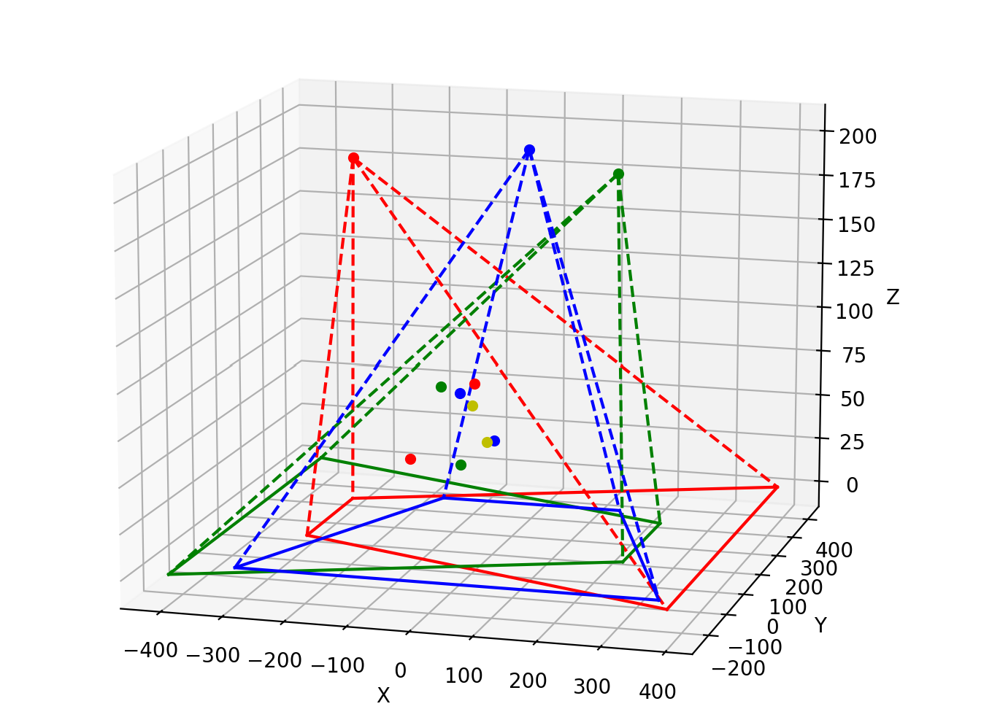
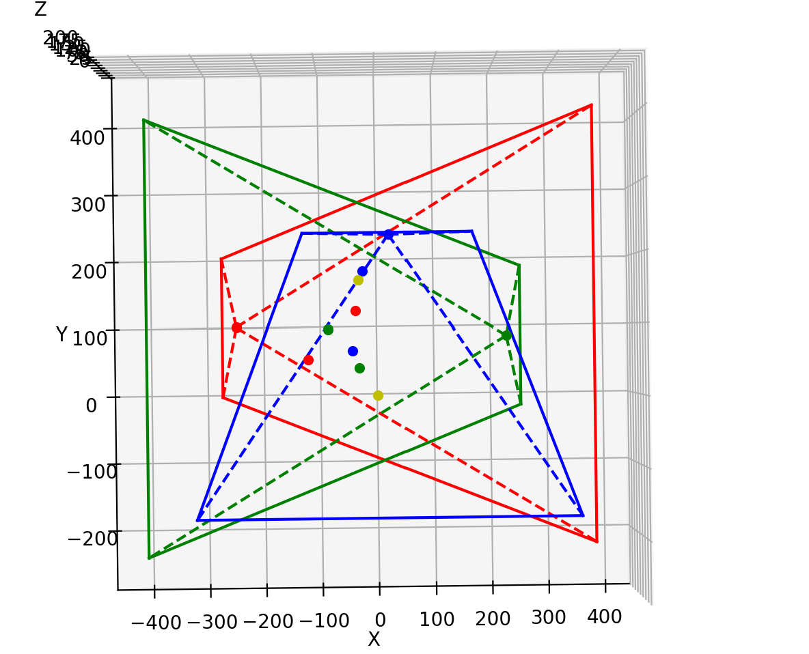

我在visual里设置了相机位姿和空间点，如两个截图。





```python
# 相机位姿
R1, t1 = pose_camera(180., -30, 0, -230., 100, 200)
R2, t2 = pose_camera(180., 30, 0, 210., 85, 200)
R3, t3 = pose_camera(150., 0, 0, 20., 225, 200)
# objs点
real_point1 = np.array([-120, 53.09 ,40.87 ]).reshape(3,1)
real_point2 = np.array([-36.8, 122.3 ,77.7 ]).reshape(3,1)
real_point3 = np.array([-31.192, 39.677, 121.91]).reshape(3,1)
real_point4 = np.array([-83.817, 96.801, 50.425]).reshape(3,1)
real_point5 = np.array([-24.135, 181, 60.323]).reshape(3,1)
real_point6 = np.array([-41.853, 65.518, 100.61]).reshape(3,1)
real_point7 = np.array([-31.44, 167.94, 60.42]).reshape(3,1)
real_point8 = np.array([0.65996, 0.62084,0.25765]).reshape(3,1)
obj1 = [real_point1, real_point2]  
obj2 = [real_point3, real_point4]  
obj3 = [real_point5, real_point6]  
obj4 = [real_point7, real_point8] 
```

